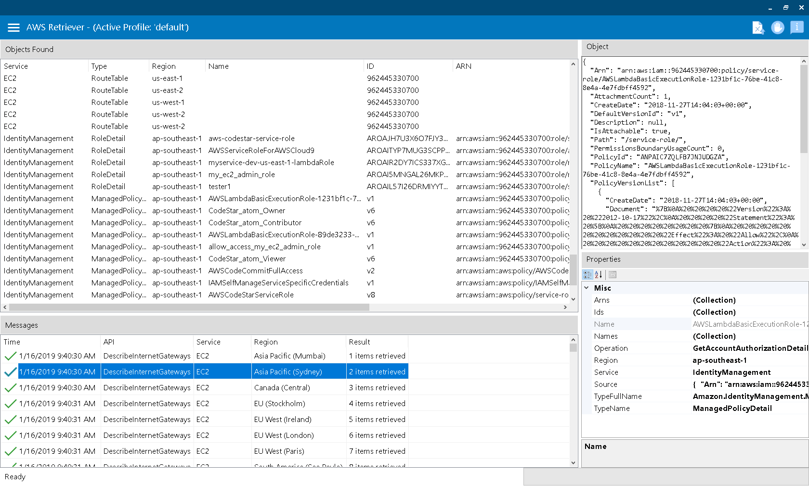
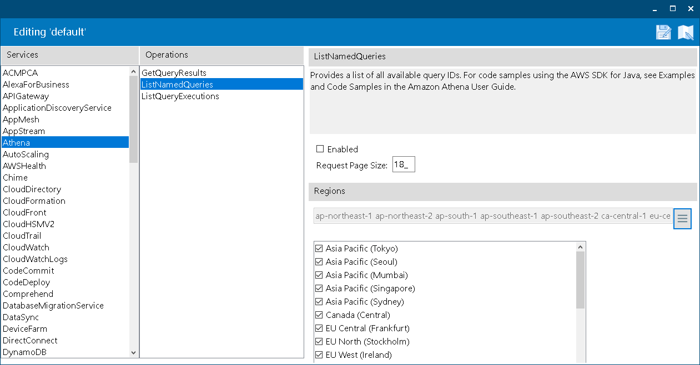
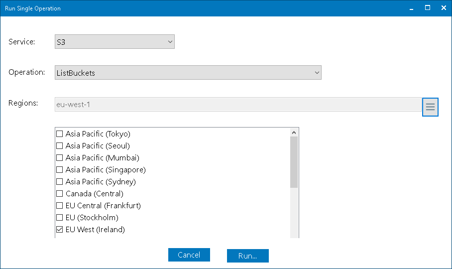

 AWSRetriever

Lists all resources in a AWS account.

[](https://dev.azure.com/dtylman/heaven/_build/latest?definitionId=1?branchName=master)

## Features

* Supports over 390 APIs from over 70 services, all regions

* Objects saved in JSON format

* Define and save profiles for specific service queries

* Runs a single operation

* CLI Support

## Overview 

AWSRetriever scans sets of predefined `AWS` APIs, saved in "profile" files.

Profiles are `json` based files, holding a (potentially) very long list of operations to run. AWSRetriever is shipped with a `default.profile.js`, that holds a generic wide-variety of calls. 

The profile is scanned when choosing "Full Scan" from the side-bar menu, or using the command-line parameter `-p` (combined with  `-r`)

Profiles can be saved & loaded. The default profile loaded is defined in the configuration file.

A typical use-case is to define and test profiles for various AWS resources views and then use the CLI to periodically retrieve the items from AWS.

### Command-line interface

To export all items provided in my `ec2.profile.js`, and save them in `object.json`, use the following switches:

```PS
>AWSRetriever.exe -r -p ec2.profile.js -o objects.json
AWS Retriever
Using profile: 'ec2.profile.js'
Writing to 'objects.json'
Queueing from 'default' profile...1825 operations queued.
Scanning...
```

To export all items to `myobjects.json` using the default profile and settings:
```PS
>AWSRetriever.exe -r -o myobjects.json
AWS Retriever
Using profile: 'default.profile.js'
Writing to 'myobjects.json'
Queueing from 'default' profile...1825 operations queued.
Scanning...
EC2 DescribeInternetGateways ap-northeast-1: 1 items retrieved
EC2 DescribeInternetGateways ap-south-1: 1 items retrieved
EC2 DescribeInternetGateways ap-northeast-2: 1 items retrieved
EC2 DescribeInternetGateways ca-central-1: 1 items retrieved
.
.
.
```

The resulting `myobjects.json` file, holds a JSON array with the following structure:
```js
[
  { 
  // the type of the object listed
  "Type" : "InternetGateway", 
  // the service it was retrieved from
  "Service" : "EC2", 
  // the region
  "Region" : "ap-northeast-2", 
  //the object itself, will change according to the object
  "Source" : { 
  "Attachments": [
    {
      "State": {
        "Value": "available"
      },
      "VpcId": "vpc-e2e9f18a"
    }
  ],
  "InternetGatewayId": "igw-0562ad6d",
  "OwnerId": "000000000000",
  "Tags": []
}}
,
.
.
.
```

### Profile Record 

Each profile record holds:
```json
 {
    "ServiceName": "EC2", // AWS service to execute
    "Name": "DescribeInternetGateways", // Specific API to execute
    "Regions": "ap-northeast-1 ap-northeast-2 ap-south-1 ap-southeast-1 ap-southeast-2 ca-central-1 eu-central-1 eu-north-1 eu-west-1 eu-west-2 eu-west-3 sa-east-1 us-east-1 us-east-2 us-west-1 us-west-2", // a list of regions to call 
    "Enabled": true, // if false, this API is skipped
    "PageSize": 18 // if this API supports paging, this value will be the page size for each request.
  },
```

## Download & Run

Download [the latest](https://github.com/dtylman/AWSRetriever/releases/) for Windows or Linux.

### Windows

1. Requires `.NET`
1. Create a folder `AWSRetriever`
1. Unzip to folder.
1. Run `AWSRetriever.exe`

### Linux / Ubuntu

Make sure mono is installed:

```bash
sudo apt-get install mono-runtime
```

```bash
mkdir awsretriver
cd awsretriver
unzip path_to_downloaded_awsretriver.zip 
mono AWSRetriver.exe
```

## Screenshots

### Main Screen with some data



### Profile Editor



### Launching a specific API



### Thanks

* [Modern UI Done Right](https://github.com/NickAcPT/ModernUIDoneRight)
* [Icons8](https://icons8.com/license/)
